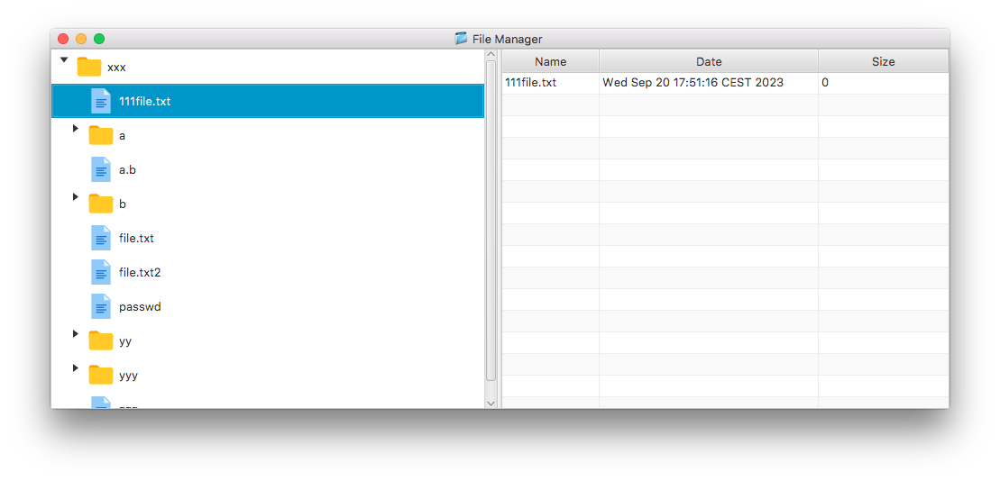

# FileManager

Simple FileManager demonstrating JavaFX TreeView.

This example is a very limited file manager that displays files and directories in a tree on the left and details on the right side. It allows navigating through the tree, opening and closing directories and using right mouse click for a context menu with file operations. Also drag and drop is allowed to move files around.

Features

- display directory tree in a tree view
- show icons for files and folders
- lazy loading of folders when expanded in tree
- asynchronous load using CompletableFuture
- drag and drop support to move files and folders
- simple context menus for file or directory creation or deletion
